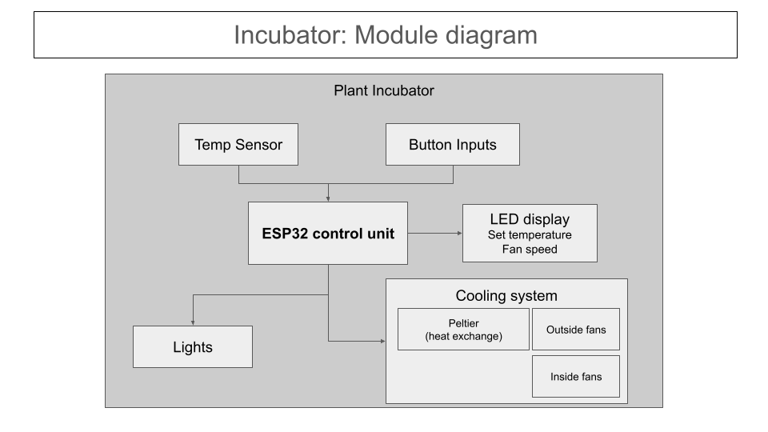

# OpenPlant Incubator

The code in this repository is open sourced and provides tools to develop a plant incubator.We hope this repository can be used as a model to inspire similar work among other research teams.

ToDo: Update this https://trello.com/b/W0jccEJs/welcome-to-the-project

Please feel free to get in touch with the team.
